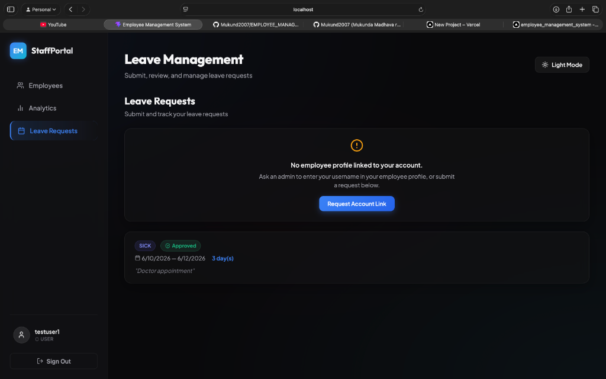
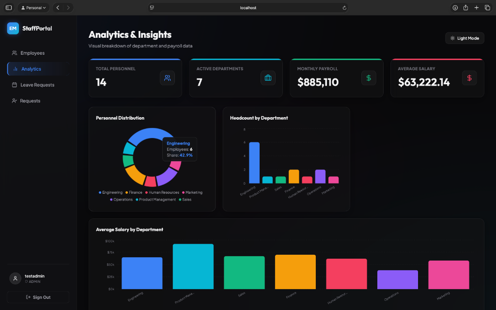
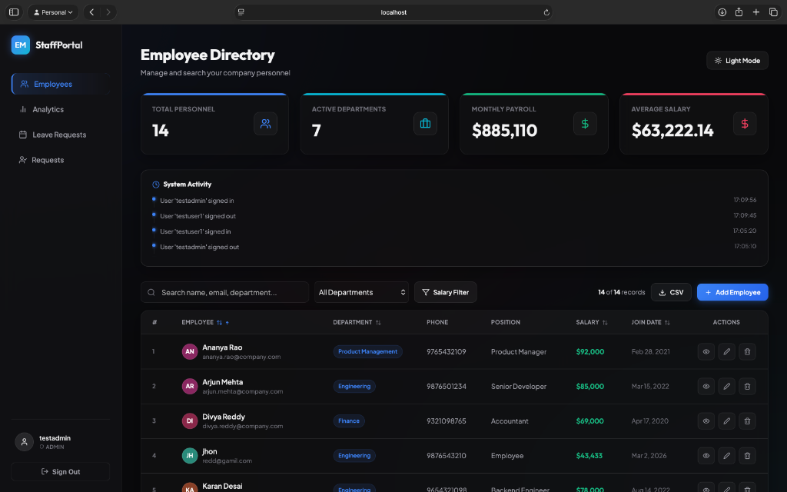

# Employee Management System (EMS)

A modern, responsive, and secure full-stack Employee Management System built with Java, Spring Boot, and React.

[](#)
[](#)
[](#)
[](#)
[](https://employeemanagementsystem-lemon.vercel.app/)

---

## 📋 Table of Contents
* [Screenshots](#-screenshots)
* [Features](#-features)
* [Tech Stack](#-tech-stack)
* [API Endpoints](#-api-endpoints)
* [Local Setup](#-local-setup)
* [Default First Login](#-default-first-login)
* [CI/CD Pipeline](#-cicd-pipeline)
* [License](#-license)

---

## 📸 Screenshots

### 👥 Employee Directory


### 📊 Analytics Dashboard


### 📅 Leave Requests & Account Link Flow


---

## ✨ Features
* 🔐 **Authentication & Authorization**: Role-Based Access Control (RBAC) supporting standard Users and Administrators (with JWT token security).
* 👤 **Account Link Requests**: Secure flow for users to submit requests containing custom messages, allowing admins to map their username to an active employee record.
* 📅 **Leave Tracker**: Full request, list, and approval workflows. Users submit leaves, while admins can approve/reject them.
* 👥 **Employee Directory**: Paginated, sortable directory supporting filters by name, department, or salary, and soft-delete capabilities.
* 📊 **Analytics Dashboard**: Visual representations of headcount distribution, salary averages, and total payroll statistics powered by Recharts.
* 🌙 **Theme Support**: Smooth and persistent Light/Dark mode transitions.
* 📥 **CSV Export**: Export all filtered employee records to a downloadable CSV file.

---

## 🛠 Tech Stack

| Technology | Purpose |
|---|---|
| **Java 17** | Base language for the backend |
| **Spring Boot 3** | Framework for developing RESTful APIs and Security (Spring Security) |
| **Hibernate / JPA** | ORM for database entity mapping |
| **MySQL 8** | Relational Database for persistence |
| **React 19** | Component-based UI library |
| **Vite** | Modern, fast build tool and dev server |
| **Recharts** | Data visualization for payroll statistics |
| **Lucide React** | Premium icon set |

---

## 🔌 API Endpoints

### Authentication
* `POST /api/auth/register` — Register a new account (Standard User or Admin)
* `POST /api/auth/login` — Sign in and retrieve JWT token
* `PUT /api/auth/change-password` — Change password for currently logged-in user
* `POST /api/auth/forgot-password` — Generate secure password recovery token
* `POST /api/auth/reset-password` — Update password using reset token

### Employee Directory
* `GET /api/employees` — Fetch paginated, sorted, and filtered employee records
* `POST /api/employees` — Create a new employee record (Admin only)
* `GET /api/employees/me` — Fetch employee profile linked to the logged-in user
* `PUT /api/employees/{id}` — Update an existing employee profile (Admin only)
* `DELETE /api/employees/{id}` — Soft delete an employee (Admin only)
* `GET /api/employees/stats` — Fetch database-wide employee statistics

### Leave Management
* `GET /api/leaves` — Retrieve all leave requests (Admin only)
* `GET /api/leaves/me` — Retrieve leave requests submitted by current user
* `POST /api/leaves` — Submit a new leave request
* `PUT /api/leaves/{id}/status` — Approve or reject leave status (Admin only)

### Account Link Requests
* `POST /api/link-requests` — Submit a linking request (User only)
* `GET /api/link-requests/me` — Get the current user's link request details
* `GET /api/link-requests` — List pending requests (Admin only)
* `PUT /api/link-requests/{id}/link` — Confirm and link a user request to an Employee record (Admin only)
* `PUT /api/link-requests/{id}/dismiss` — Dismiss a link request (Admin only)

---

## ⚙️ Local Setup

### 1. Database Configuration
Create a local MySQL database:
```sql
CREATE DATABASE ems;
```

### 2. Configure Environment Variables
Inside the `backend/` directory, create a `.env` file by copying the template from `.env.example`:
```bash
cp backend/.env.example backend/.env
```
Open `backend/.env` and fill in your MySQL database credentials:
* `DB_URL`: JDBC url (`jdbc:mysql://localhost:3306/ems`)
* `DB_USERNAME`: Database user
* `DB_PASSWORD`: Database password
* `JWT_SECRET`: Secure secret token string

### 3. Run Backend
```bash
cd backend
./mvnw spring-boot:run
```

### 4. Run Frontend
```bash
cd frontend
npm install
npm run dev
```

---

## 🔑 Default First Login
On your first run, no accounts are preloaded in the database.
1. Navigate to the sign-up page and register an account, choosing the **ROLE_ADMIN** or **ROLE_USER** system role.
2. Sign in using the credentials you just registered.
3. If logging in as an Admin, populate the database with Employee records and manage incoming link requests from Users!

---

## 🚀 CI/CD Pipeline
GitHub Actions is configured to run build checks automatically on every push or pull request to the `main` branch to verify code compiling and dependencies.
The workflow file is located in [`.github/workflows/frontend-ci.yml`](.github/workflows/frontend-ci.yml).

---

## 📄 License
Distributed under the MIT License. See [LICENSE](LICENSE) for more details.
